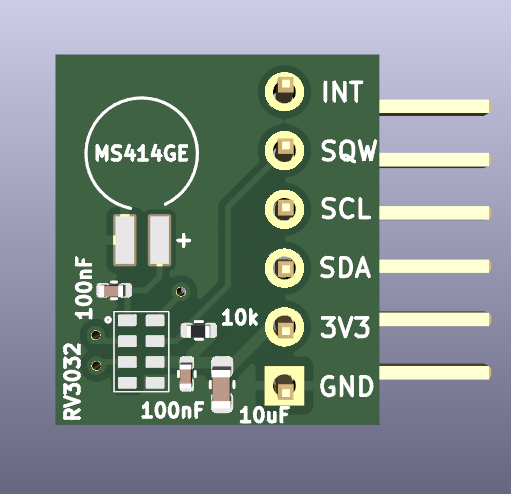

# RV-3032 Kicad PCB

A replacement of the DS3231 with the same board pinout:

| DS3231 | RV3032 | Description                                     |
|--------|--------|-------------------------------------------------|
| GND    | GND    | GND                                             |
| VCC    | VCC    | 2.0-5.5V                                        |
| SDA    | SDA    | I2C SDA                                         |
| SCL    | SCL    | I2C SCL                                         |
| SQW    | CLKOUT | Temperature compensated square wave             |
| 32K    | INT    | DS3231: oscillator clock; RV3032: interrupt pin |

See [schematics.pdf](./schematics.pdf).

